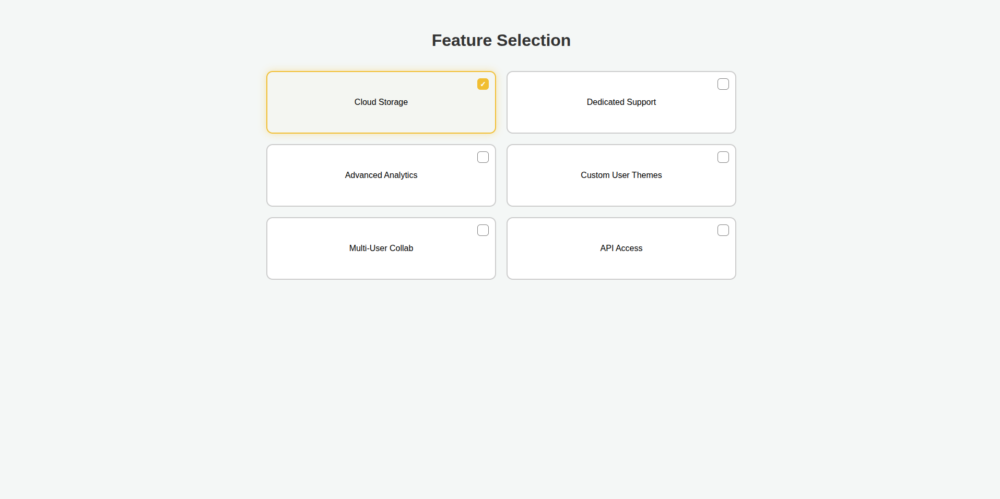

# 🌐 Feature Selection Page - 

This project is part of the **freeCodeCamp Responsive Web Design Certification**. In this lab, the objective was to build a feature selection interface that is functionally similar to the example project while applying a personal style. The focus lies on mastering custom checkbox interactions and responsive grid layouts.

## 🛠 Technologies
* **HTML5:** Utilized semantic labels and checkboxes to create an accessible selection interface.
* **CSS3:** Implemented a 2-column grid layout using Flexbox and utilized the `:has()` pseudo-class for parent element styling.

## 🚀 Features
* **Custom Interactive Cards:** Entire cards serve as click targets for a better user experience.
* **Responsive Design:** A flexible 2-column grid that adapts using `calc()` for precise spacing.
* **Visual Selection States:** Dynamic feedback through border-color changes and box-shadows when a feature is selected.

## 🧠 The Process (freeCodeCamp Workshop)
1. **Layout Strategy:** Developed a flexible grid container to organize features into a clean, scannable structure.
2. **UI Customization:** Overrode default checkbox styling to create a modern, integrated look within the cards.
3. **State Management:** Used CSS selectors to ensure visual consistency between the hidden checkbox and the visible card state.

## 💻 Running the Project
1. Clone the repository.
2. Open `index.html` in your browser.

## 🖼 Preview

### Quick Links
[Live Demo](https://rkraus-dev.github.io/fcc-design-a-feature-selection-page/) *(Coming Soon)*